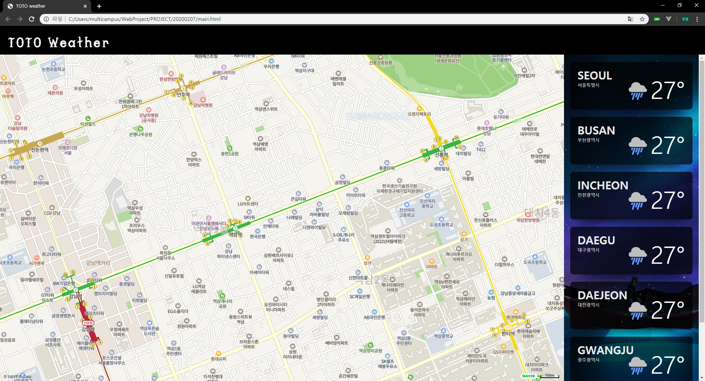

# WEB PROJECT
- **When?** 2020.02.07 ~
- **What?** 날씨 및 달력 등을 포함한 웹 페이지 제작하기
- **How?** HTML, CSS, JavaScript, Vue.js, MongoDB 등을 이용

<br>

## Index

- [Day 1](#day-1-20200207)

<br>

### Day 1: 2020.02.07

1. git 관련 환경설정 구축

   > 자리가 바뀌었기 때문에 서버 저장소와 로컬 저장소를 연동하기 위해서는 환경설정도 다시 해야했다. `제어판` - `자격 증명 관리자` - `Windows 자격 증명`에서 git 관련 저장된 계정 등을 삭제한다.

   - git user 바꾸기

     ```
     $ git config user.name "$(USERNAME)"
     $ git config user.email "$(USEREMAIL)"
     ```

   - 새로운 ssh-key 받기

     ```
     $ ssh-keygen
     $ cat ~/.ssh/id_rsa.pub
     ```

     이 때, 나오는 항목에서 overwrite 하겠냐는 항목에 엔터를 누르면 키 생성이 안 된다 :cry: 이것 때문에 애를 먹었는데, 반드시 `y`를 치고 넘어갈 것! `$ cat ~/.ssh/id_rsa.pub` 를 통해 나오는 ssh-key를 git에 등록해주면 된다.

   - 서버 저장소와 로컬 저장소를 연동하기

     ```
     $ cd $(USERDIRECTORY)
     $ git init
     $ git clone $(GITURL)
     ```

     `GITURL`에는 내가 연동하고 싶은 저장소의 **HTTP 주소**를 적어주면 된다. 잘 모르고 SSH 주소로 시도하다 안 돼서 멘붕이 왔었다 .... :scream: 

   - 커밋과 푸시하기

     ```
     $ git add $(YOURFILE)
     $ git commit -m "COMMIT MESSAGE"
     $ git push -u origin master
     ```

     그럼 이제 git 로그인 창이 뜰 텐데, 그 때 로그인을 해주면 연동 완료!

<br>

2. 전체적인 기능 구상하기

   > (1) 메인 화면은 지도와 *~~사용자가 추가할 수 있는~~*(아직 미정) 도시 위젯으로 구성된다.
   >
   > (2) 도시는 검색으로 추가할 수 있으며, 각 도시를 클릭하면 지도의 위치가 변경된다.
   >
   > (3) 지도에는 현재 보이는 지역의 날씨가 간단하게 아이콘으로 보인다.
   >
   > (4) Todo를 위한 달력이 별도 메뉴로 있다. 해당 날짜를 클릭해서 Todo를 등록할 수 있으며, 해당 내용은 DB에 저장이 된다. *~~월간 달력에는 "완료한 Todo / 저장한 Todo"가 간단하게 보이도록 한다.~~*(아직 미정)

<br>

3. 메인화면 레이아웃 구성하기

   - 위쪽은 로고, 왼쪽은 지도, 오른쪽은 추가할 수 있는 위젯으로 구성했다.

     ```html
     <!-- main.html -->
     
     <div class="wrapper">
        <div class="top">
            
        </div>
        <div class="left" id="map">
            지도가 들어갈 곳
        </div>
        <div class="right">
            <div class="widget">
                <div class="left-panel panel">
                    <div class="city_eng">City</div>
                    <div class="city_kor">도시 이름</div>
                </div>
                <div class="right-panel panel">
                    
                    <div class="temp">00&deg;</div>
                </div>
            </div>
        </div>
     </div>
     ```

   - 아래 css는 화면을 margin없이 꽉 채울 수 있는 코드이다. 다음에 참고해야겠다. :clap:

     ```css
     /* main.css */
     
     * {
         margin: 0px;
         padding: 0px;
     }
     
     html, body {
         height: 100%;
         width: 100%;
     }
     
     .wrapper {
         width: 100%;
         height: 100%;
     }
     ```


   - 완성된 레이아웃 및 디자인

     

   

